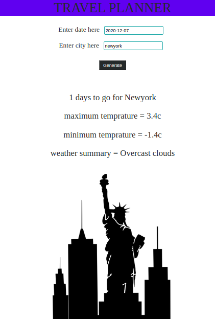

## Travel planner 

In this application you can enter city you want to visit and the date of visit then you get the weather forcast of that day and image of that city.

* three different api's is being used in this project, so sign up in _geonamesapi_ & _weatherbitapi_ & _pixabayapi_ and get base url and api keys and declare them in _.env_ file
according to used variable name in _server.js_ file

* npm start(for express server)

* npm run dev(for webpack server)

## image 

